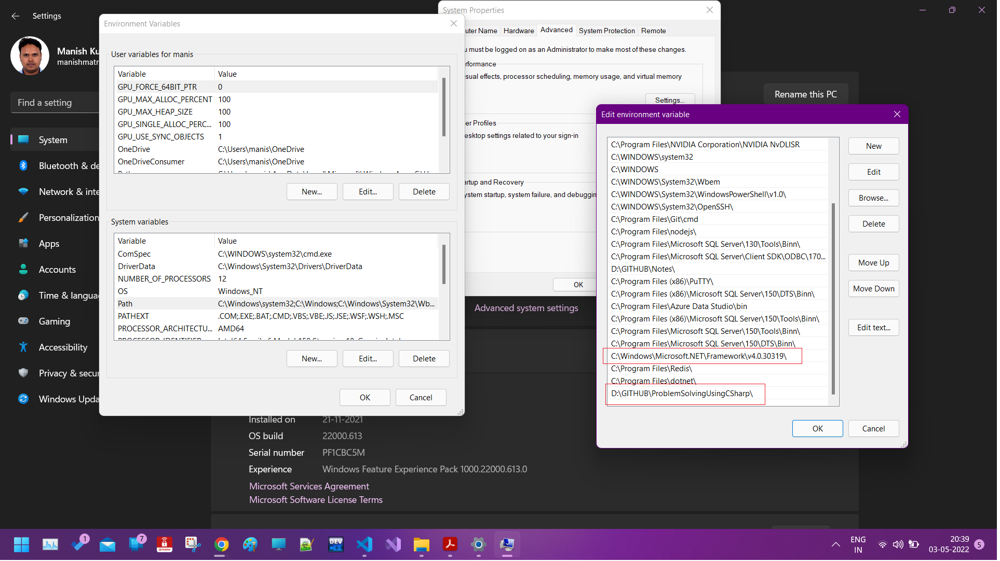

# Problem Solving using C Sharp (C#)

This repository is my final and most sincere attempt at learning Data Structures and Algorithms. As I'm most comfortable with C# as a programming language, I intend to leverage this to learn problem solving for Product based company interviews.

## Building and running C# Programs

Yes, we could have used Visual Studio, but because it create unnecessary folder, i decided against it.
I wrote a custom `runcs.bat` file to build and run the cs program files.

You must run the command like: `.\runcs .\_0_HelloWorld` or `runcs .\_0_HelloWorld` or `.\runcs .\_0_HelloWorld.cs` or `runcs .\_0_HelloWorld.cs`

Files similar to `runcs.bat`, you can find [here](https://github.com/fullstack-storyteller/Notes)

## How to run .bat files from cmd

- First create the .bat file
- Test in thoroughly by testing it command prompt and by supplying various inputs
- Setup an system environment variable named `Path`. You can create new such variable or append the location of the newly created .bat file to the list of locations already present.
- Save the dialog box and now you are ready to execute the command using the .bat file name itself, just like the `runcs.bat` file.

**Note:** Remember that the commands written in the .bat files amy themselves need to be set up. For example, the `csc filename.cs` command needs to access a system environment variables which will help the command line find where the C# compiler is present. In my PC, we have the below locations for environment variables.

### Ensure proper note-taking and Programming examples
